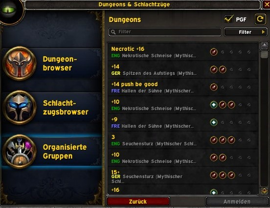

# **PremadeRegionsEU**

PremadeRegionsEU shows region information next to groups in the premade groups listing and applicant which is particulary useful for players in Europe.

> [For players in the Oceanic regions (Australia and New Zealand).](https://www.curseforge.com/wow/addons/premade-regions)

The addon also provides data for the [Premade Groups Filter](https://www.curseforge.com/wow/addons/premade-groups-filter).

When used as a standalone add-on it will show the region of the group leader or applicant. When used in combination with [Premade Groups Filter](https://www.curseforge.com/wow/addons/premade-groups-filter) you can also filter the group by the group leaders region.

## Resources

[Project on Curse.com](https://www.curseforge.com/wow/addons/premade-regions-europe)
[Premade Groups Filter](https://www.curseforge.com/wow/addons/premade-groups-filter)
> [For players in the Oceanic regions (Australia and New Zealand).](https://www.curseforge.com/wow/addons/premade-regions)
